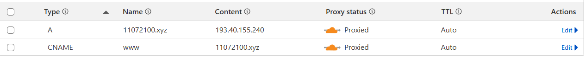

# About the project
Events Organiser is an application that eases the hassle of having to manually mark events from emails to calendar by automating this process.

# Project structure
This is a general overview of where the project files reside
```
.
├── ansible                 # Playbooks for automatically setting this application up in a Ubuntu server
├── misc                    # Code that is made as a prototype or to help improve the app in some way. This is basically a testing ground for code.
|   ├── app_testing         # Validation (parsing performance, LLM parsing accuracy) related tests
|   ├── finetune            # Training data & training program to finetune LLM to work better for finding events
|   └── microsoft_auth_prototype    # First prototype of the events organiser app
|
├── react-webpage           # Source files (alternatively `lib` or `app`)
|   ├── dist                # Compiled website files w/ javascript bundles
|   └── src                 # Source files for the React app
|
├── services                # Backend microservices
|   └── service
|       ├── common          # Common python files for the public and private service
|       ├── public          # Files for the microservice which is accessible publicly
|       └── private         # Files for the microservice which can only be accessed inside the cluster
|
├── LICENSE
└── README.md
```

# Setup guide
This guide explains how to set the application up using mostly Ansible with some manual setup.

## Prerequisites
### At least two VMs
Requirements for these VMs: 
1. at least 4 cores
2. 8GB of RAM
3. Ubuntu 22.04 (other distros might work, but this app hasn't been tested on them)
4. default ports for MySQL, RabbitMQ, HTTP(s) and Kubernetes are open

If you can't have two VMs, then you will need to use the following command after setting up kubernetes: `kubectl taint node mymasternode node-role.kubernetes.io/master:NoSchedule-`. This will allow pods to be ran on that VM.

### Ansible
Latest version of Ansible.

### Node.js
Any version above v20 can be installed.

### Docker
Latest version of Docker.

## Installation
1. Clone this repository and go into the newly created directory
    ```
    git clone https://github.com/madiskoivopuu/EventsOrganiser.git
    cd EventsOrganiser
    ```
2. Go into the `react-website` folder
    ```
    cd react-webpage
    ```
3. Create `.env` and `.env.production` file and fill it out according to `.env.example`
4. Install the project dependencies & build the React app
    ```
    npm install
    npm run build
    ```
5. Go into the `dist` directory, rename `index-prod.html` to `index.html` and run the following command
    ```
    cd dist
    mv index-prod.html index.html
    tar -cf website.zip .
    ```
6. Open another terminal, ssh into the controller VM and run the following commands
    ```
    sudo mkdir -p /var/www/events-organiser
    sudo chown -R ubuntu:ubuntu /var/www/events-organiser
    ```
7. Go back onto the previous (old) terminal and copy the website.zip file over
    ```
    scp ./website.zip ubuntu@IP-ADDRESS:/var/www/events-organiser
    ```
8. Use terminal 2 for the last time for these commands, which will unzip the website files
    ```
    cd /var/www/events-organiser
    sudo rm -rf assets
    sudo tar -xvf website.zip
    sudo rm website.zip
    ```
9. Go into the `services` folder
    ```
    cd ../../services
    ```
10. Create `.env` file and fill it out according to `.env.example`
11. Log in to your Docker Hub account
    ```
    docker login
    ```
12. Build & push the containers to Docker Hub. For another container registry, you need to edit the `docker-compose.yml` file
    ```
    docker compose build --push
    ```
13. For each VM, ssh into it add all the servers' hostnames along with internal IPs to `/etc/hosts`. An example is down below
    ```
    127.0.0.1 localhost
    192.168.42.60 events-org-controller
    192.168.42.182 events-org-worker1
    192.168.42.195 events-org-worker2

    # The following lines are desirable for IPv6 capable hosts
    ::1 ip6-localhost ip6-loopback
    fe00::0 ip6-localnet
    ff00::0 ip6-mcastprefix
    ff02::1 ip6-allnodes
    ff02::2 ip6-allrouters
    ff02::3 ip6-allhosts
    ```
14. Set up the servers using the Ansible playbook provided in `ansible` directory (README.md will explain what to do)

15. (Informational) When using a domain name provider, change the A records for your domain to point to the controller's IP.

    You can find an example of how it was done for the test domain for this application.
    